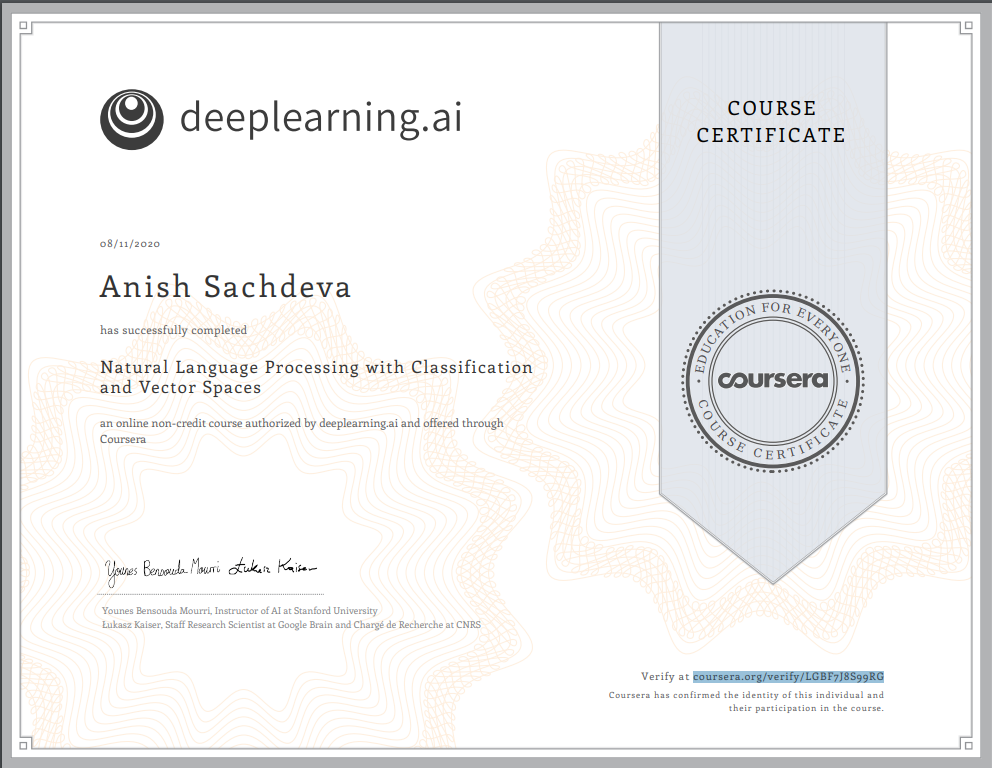

# Natural Language Processing with Classification and Vector Spaces @ Coursera
__~deeplearning.ai__   

## Index
- [Week 1](#week-1)
- [Week 2](#week-2)
- [Week 3](#week-3)
- [Week 4](#week-4)
- [Certificate](#certificate)

## Week 1
- [Lab: Data Preprocesing](https://www.coursera.org/learn/classification-vector-spaces-in-nlp/ungradedLab/TXtyC/lab)
- [Lab: Building Word Frequencies](https://www.coursera.org/learn/classification-vector-spaces-in-nlp/ungradedLab/13HKM/lab)
- [Lab: Visualizing Tweets and Logistic Regression](https://www.coursera.org/learn/classification-vector-spaces-in-nlp/ungradedLab/GeAyH/lab)
- [Programming Assignment: Logistic Regression](week_1/logistic-regression.ipynb)

## Week 2
- [Lab: Visualizing Naive Bayes](week_2/visualizing-naive-bayes.ipynb)
- [Programming Assignment: Naive Bayes](week_2/naive-bayes.ipynb)

## Week 3
- [Lab: Linear Algebra In Python with Numpy](week_3/linear-algebra.ipynb)
- [Lab: Manipulating Word Embeddings](week_3/manipulating-word-embeddings.ipynb)
- [Lab: Another Explanation on PCA: Principal Component Analysis](week_3/pricipal-component-analysis.ipynb)
- [Programming Assignment: Word Embeddings](week_3/word-embeddings.ipynb)

## Week 4
- [Lab: Rotation Matrices in R2](week_4/rotation-matrices-in-r2.ipynb)
- [Lab: Vector Manipulation in Python](week_4/vector-manipulation-in-python.ipynb)
- [Lab: Hash Tables](week_4/hash-functions-and-multiplanes.ipynb)
- [Programming Assignment: Word Translation](week_4/word-translations.ipynb)

## [Certificate](http://coursera.org/verify/LGBF7J8S99RG)

